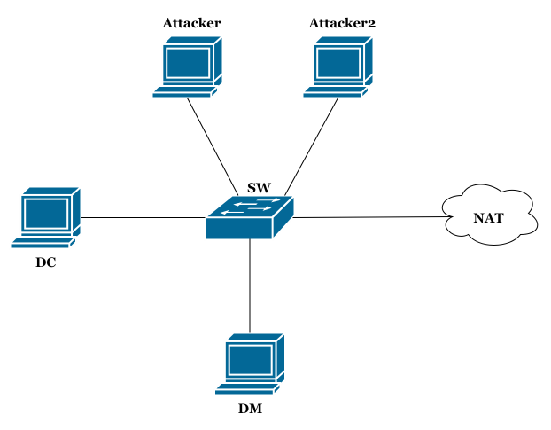

# Active Directory Labs

## Description

This repository provides penstesters and students with two intentionally vulnerable Active Directory (AD) environments using Samba and Microsoft AD within the GNS3 network emulator, which can be used to practice and learn Active Directory pentesting.

## Summary
This repository walks you through setting up two AD pentesting labs: one with Samba (domain polaris.org) and the other using Windows Active Directory (domain polaris.local). Both labs use the same network setup, users, and vulnerabilities (where applicable), but differ in their environments and domain configurations. You can follow the full lab setup in this guides ([Samba Lab](./Samba%20Lab/Samba_configurations.md), [Windows Lab](./Microsoft%20AD%20Lab/Windows_configurations.md)).

The topology includes several components such as the Domain Controller (DC), the Client Workstation (DM), and the Attacker
machines (Attacker and Attacker2), all interconnected through the Switch (SW) to simulate a realistic
network environment suitable for testing various Active Directory attacks. Additionally, a NAT is required
to provide Internet access within the GNS3 environment, enabling updates, tool installations, and other
necessary connectivity for the laboratory.

The domain users are consistent in both laboratories and the Table below lists the domain users, their roles, and associated credentials.

|    **User**   |    **Password**   | **Description**                                  |
|:-------------:|:-----------------:|--------------------------------------------------|
| Administrator | Passw0rd          | Administrative Account                           |
|  skyler.white | Password123       | Weak Password                                    |
|  saul.goodman | beTTer@caLL@me    | Password in the Description                      |
| jesse.pinkman | Wang0Tang0!       | Kerberos disabled Pre-Authentication             |
|  walter.white | Metho1o590oA$elry | SPN/ Sonstrained Delegation (Windows)            |
| hank.schrader | sHyangja@10       | Regular User (Samba) \| ACLs and GPOs (Windows)  |

## Requirements
- GNS3 Network Emulator

